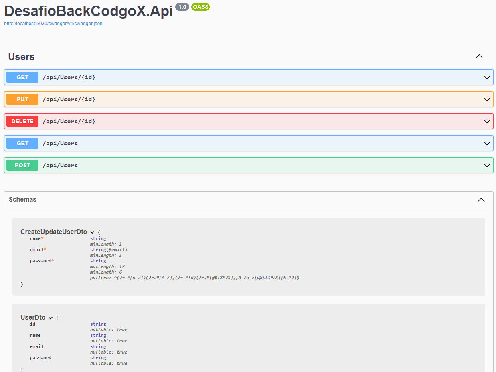

# Pair programming Back End

## Instruçoes para executar o projeto

- Inicializar a API

```cmd
cd DesafioBackCodgoX.Api
dotnet run
```

- Para realizar os testes
> Acesse: http://localhost:5030/swagger/index.html

## Objetivo do teste

Implementar o endpoint de login

---
